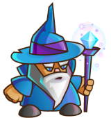
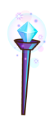
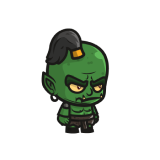
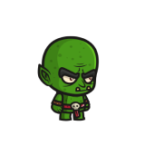
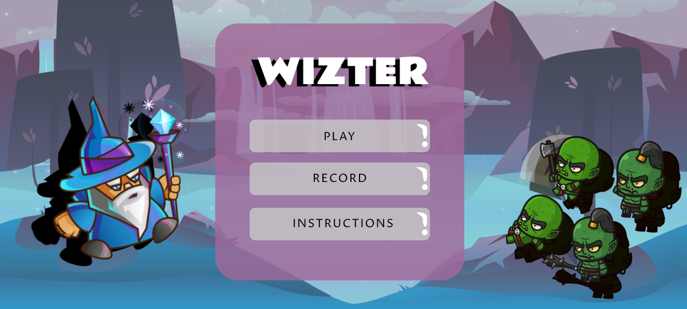
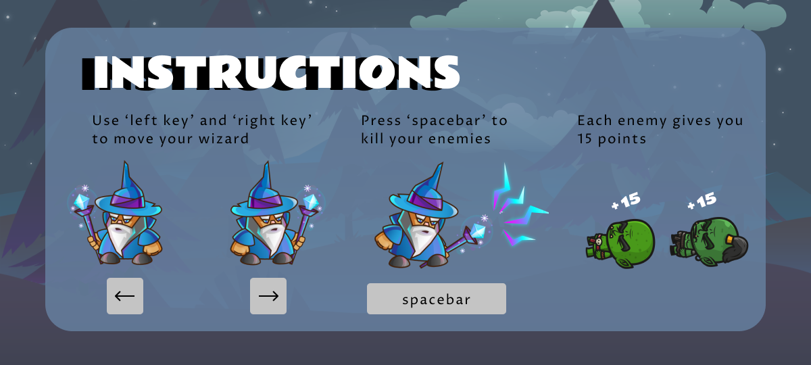
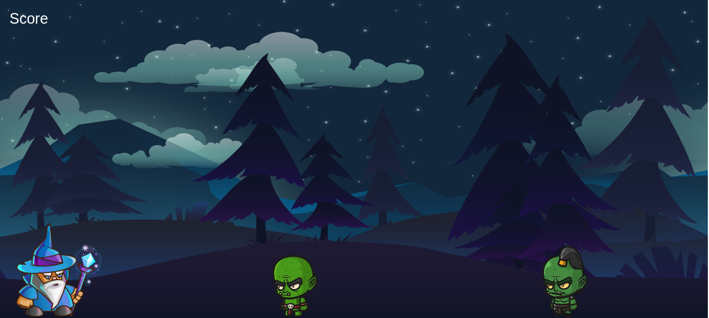
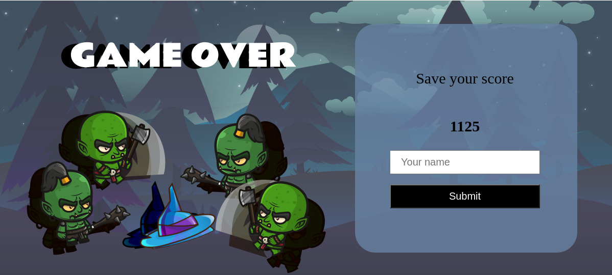
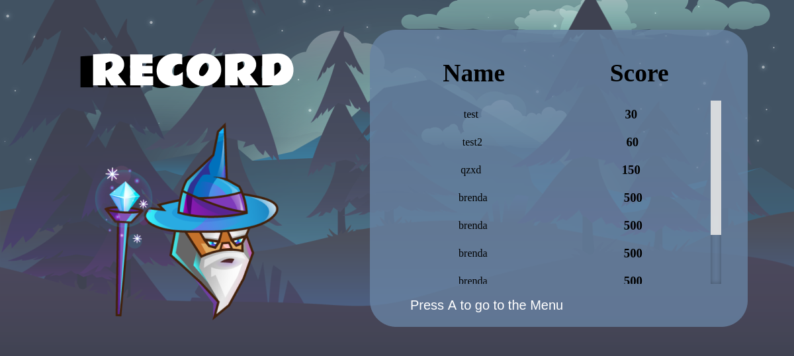

# Shooter Game: Wizter

## Description

This shooter game was built using Phase 3 based on Microverse ***Javascript Capstone requirements***

## Instructions

### How to Install

If you want to install the project follow these instructions:

*Otherwise, you can play online [here](https://desolate-earth-23488.herokuapp.com/)*

- Click on ***code*** and clone with SSH
- Go to wherever you want to store the game
- Open your terminal and type **git init** and enter
- Then type **git clone** -*paste the link copied*- and enter
- Finally open the project with your IDE (e.g: Visual Studio Code)
- Open the terminal from that project
- Run 'node server.js'
- Finally go to your browser and type **localhost:8080**

### How to play

You only need to press 'left key' and 'right key' to move the wizard and use 'spacebar' to attack the enemies.

Each enemy(goblin and orc) dead will give 15 points.

If any of the enemies attacks you, you die and the game ends. After that, you can submit your score.

## Design

This game includes 1 hero and 2 enemies:
### The Hero

- Name: The Wizard
- Objective: Protect the kingdom
- Attack: Ice 
- Weapon: Magic Wand 

### Enemy

- Name: Orc
- Objective: Attack everything
- Weapon: Mace 

### Enemy

- Name: Goblin
- Objective: Attack everything
- Weapon: Axe 

## Scenes

### Main Menu

### Game Instructions

### Game

### Game Over

### Record

## Future Implementations

- Add stages
- Add music
- Add multiplayer

## Built With

- JavaScript
- A bit of HTML and CSS for the front end
- Phaser 3
- Webpack
- Eslint
- Babel
- Jest
- Express
- Github
- Heroku for deployment
- Leaderboard API service for save record data

## Resources

- Wizard sprites **[here](https://craftpix.net/freebies/wizard-character-free-sprite/)**
- Enemies sprites **[here](https://craftpix.net/freebies/free-orc-ogre-and-goblin-chibi-2d-game-sprites/)**
- Parallax backgrounds **[here](https://craftpix.net/freebies/free-horizontal-2d-game-backgrounds/)**
- [Leaderboard API](https://www.notion.so/microverse/Leaderboard-API-service-24c0c3c116974ac49488d4eb0267ade3)
- Build a space shooter with Phaser 3 **[Tutorial](https://learn.yorkcs.com/category/tutorials/gamedev/phaser-3/build-a-space-shooter-with-phaser-3/)**

## Live Demo

[Live Demo Version](https://desolate-earth-23488.herokuapp.com/)

## Testing Suite

- Jest

## NPM available scripts
Use "npm run-script " followed by any of the following commands : 

- "build": "webpack --mode production"
- "watch": "webpack --mode development --watch"
- "test": "jest"

## Author

👤 **Brenda Yucra**

- Github: [@bren2102](https://github.com/bren2102) 
- Twitter: [@BrendaYucra2](https://twitter.com/BrendaYucra)
- Linkedin: [Brenda Yucra](https://www.linkedin.com/in/brenda-yucra-51980681/)

## 🤝 Contributing

Contributions, issues and feature requests are welcome!

Feel free to check the [issues page](https://github.com/bren2102/Wizter_js/issues).

## Show your support

Give a ⭐️ if you like this project!
